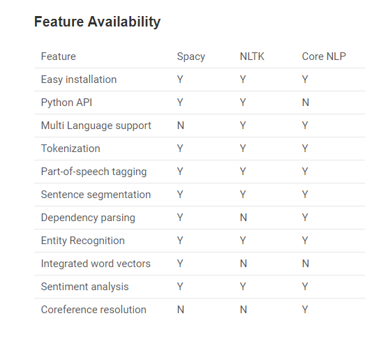
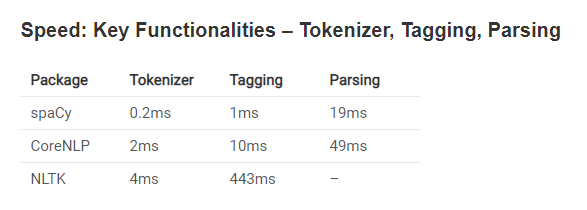
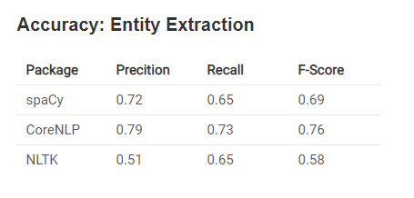
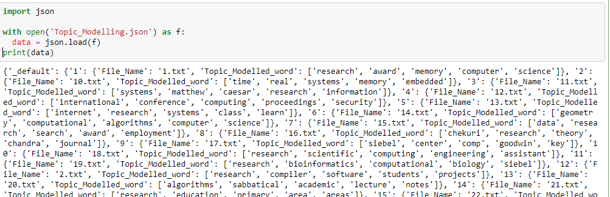
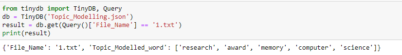
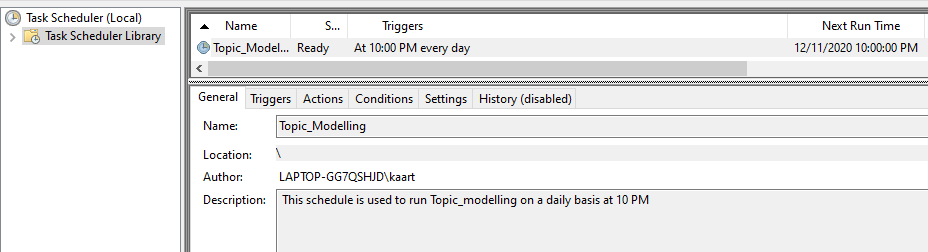
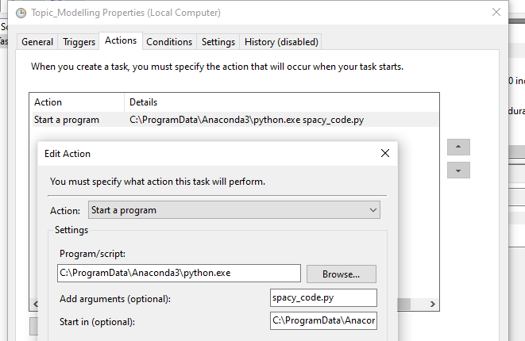

## Topic Modelling

Spacy is written in cython language, (C extension of Python designed to give C like performance to the python program). Hence is a quite fast library. spaCy provides a concise API to access its methods and properties governed by trained machine (and deep) learning models.We have used spaCy library to do topic modeling on bio pages and include it in the compiled BIO's.

## Setup

Spacy, its data, and its models can be easily installed using python package index and setup tools. Use the following command to install spacy in your machine:
```bash
#Use the following command to install spacy in your machine
sudo pip install spacy

#To download all the data and models, run the following command, after the installation:
python -m spacy.en.download all

#To load nlp for english. Use the below commands
nlp = spacy.load("en_core_web_sm")
```

## Comparison with other libraries

Spacy is very powerful and industrial strength package for almost all natural language processing tasks.
comparison of Spacy with other famous tools to implement nlp in python – CoreNLP and NLTK.








## Part of Speech Tagging done in the code

Part-of-speech tags are the properties of the word that are defined by the usage of the word in the grammatically correct sentence. We have used part of speech tagging SPacy property in our code . We also added few text cleaning function to remove unwanted information.


```bash
def isNoise(token):
    is_noise = False
    if token.pos_ in noisy_pos_tags:
        is_noise = True
    elif token.is_stop == True:
        is_noise = True
    elif len(token.string) <= min_token_length:
        is_noise = True
    elif token.string.lower().strip() in stop_words:
        is_noise = True
    elif token.string.strip() in ents:
        is_noise = True
    return is_noise
    

def cleanup(token, lower = True):
    if lower:
        token = token.lower()
    return token.strip()
```

Once the Tokenazation and text cleaning are done. we print top five key words modelled out of SPacy from the compiled BIO pages

```bash
    from collections import Counter	
    cleaned_list = [cleanup(word.string) for word in document if not isNoise(word)]
    counts=Counter(cleaned_list).most_common(5)   
```

The data is saved in tinyDB to reteieve for the future use.

## TinyDB

TinyDB is a lightweight document oriented database optimized. It’s written in pure Python and has no external dependencies. Their target target are small apps that would be blown away by a SQL-DB or an external database server.TinyDB has been tested with Python 3.5 - 3.8 and PyPy.

Some sample usage of TinyDB

```bash
from tinydb import TinyDB, Query
db = TinyDB('/path/to/db.json')
db.insert({'int': 1, 'char': 'a'})
db.insert({'int': 1, 'char': 'b'})
```

## Usage of Tiny DB in the code

Once the topic modelling is complete, we consolidate the results and save the top 5 key words in for each file in TinyDB. Whole code is setup in cron and it runs once a day and final modelled data is stored in Json format in TinyDB. This data can be queried like a typical database from python based on the file name whenever needed.


## Format in which data is stored in TinyDB

Below is the format in which data is stored in TinyDB.



Below is the sample Query to retrieve the data from TinyDB based on file name.



The final Topic_Model_Results.json has been added in the GIT repository for reference.

## Task Scheduling:

I have scheduled the Python Script to run on a daily basis at 10 PM using Task Scheduler in windows and this will keep the TinyDB up and running on a daily basis.






